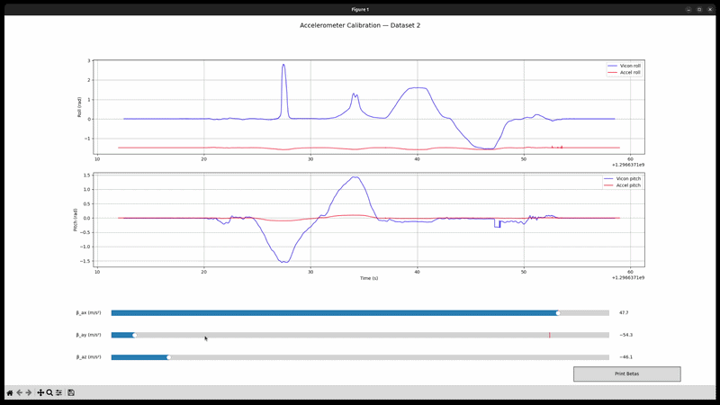
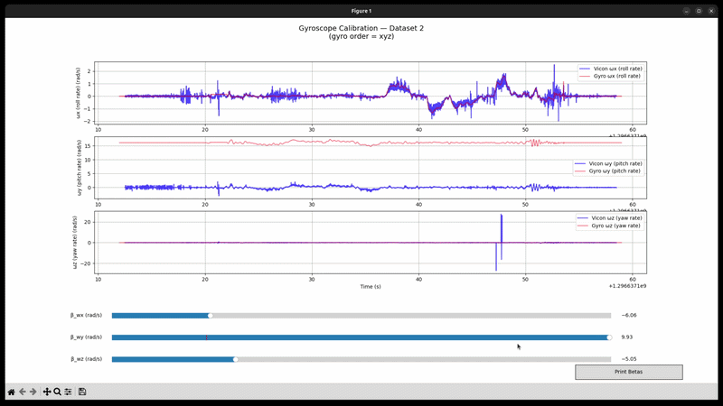
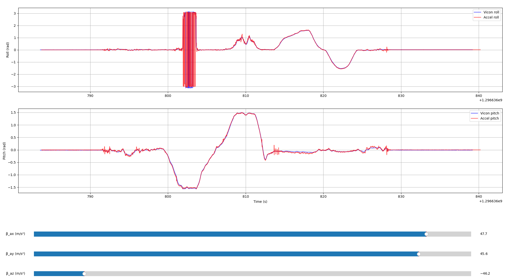
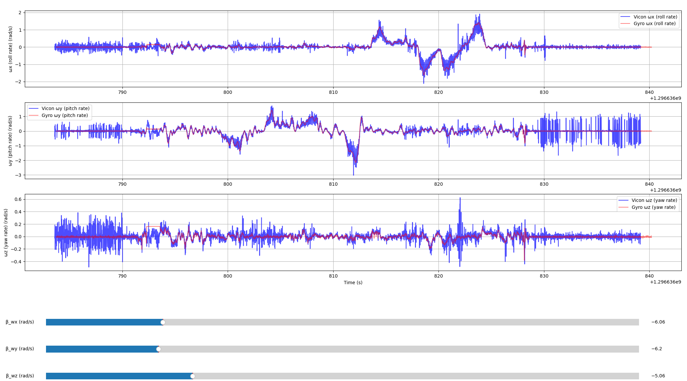
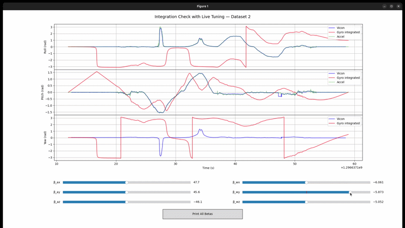
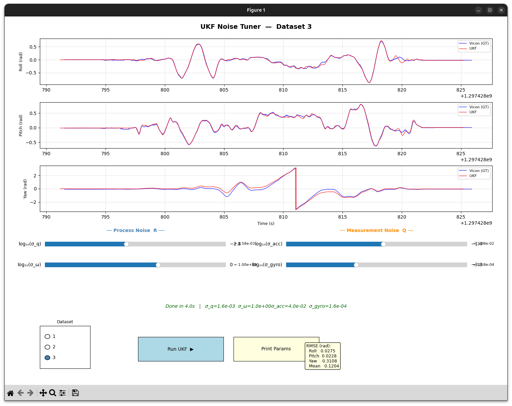
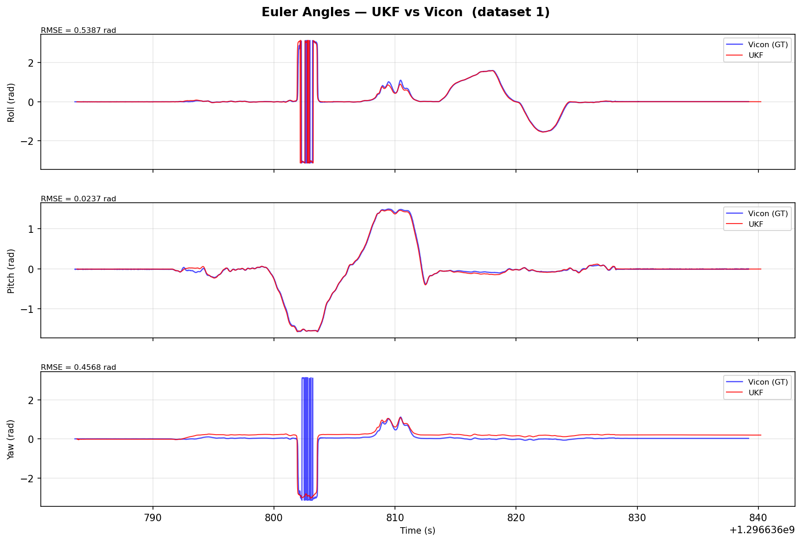
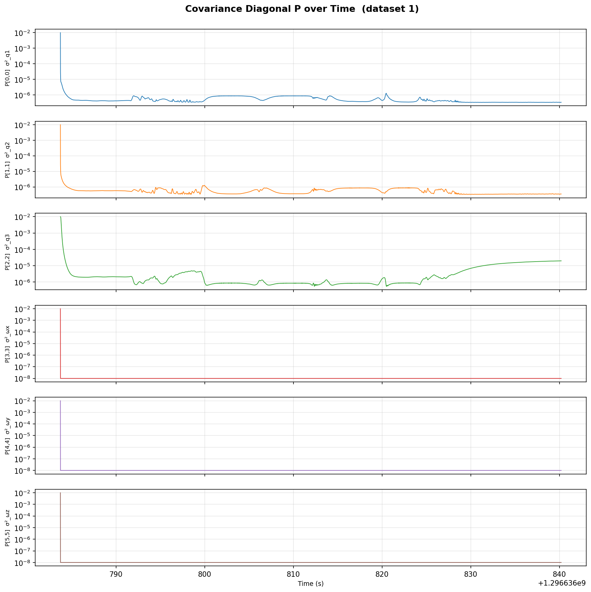
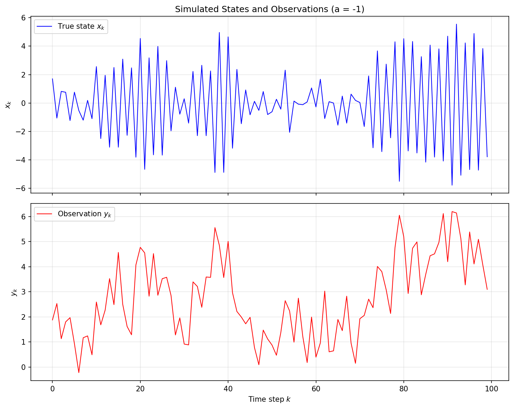
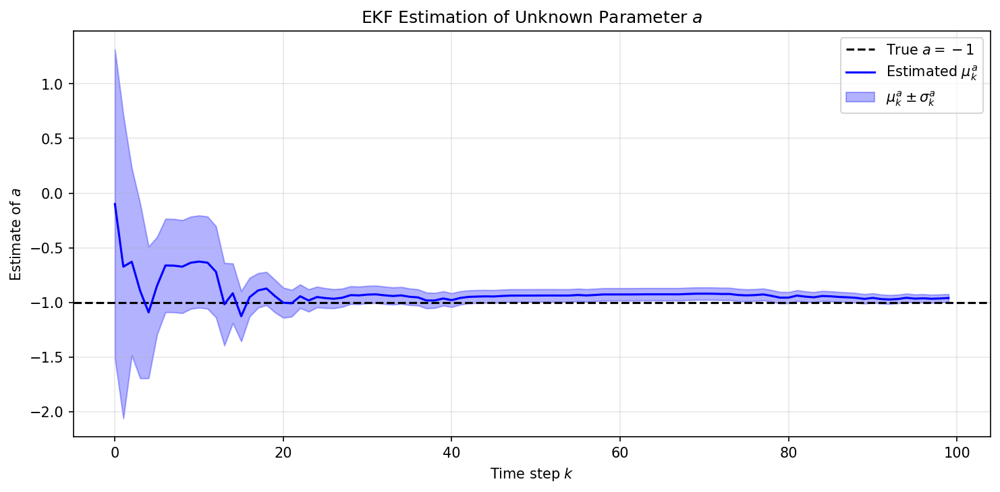

# Learning in Robotics

.gifs and visualizations take a few seconds to load...

## About
This repository contains projects completed for **ESE 6500: Learning in Robotics (Spring 2026)** at the **University of Pennsylvania**, taught by **Prof. Pratik Chaudhari**.
Course page: [pratikac.github.io/pub/25_ese650.pdf](https://pratikac.github.io/pub/25_ese650.pdf)

The course covers **state estimation**, **optimal control**, and **reinforcement learning** for robotic systems — from Kalman filtering and particle filters to policy gradients and Q-learning.

---

## HW 2 — Unscented Kalman Filter (UKF) for 3D Orientation Estimation

**Goal:** Implement an Unscented Kalman Filter (UKF) to track the orientation of an IMU in three dimensions, fusing accelerometer and gyroscope measurements against Vicon motion-capture ground truth. Score: **56/56** on the Gradescope autograder.

### The UKF on SO(3)

This is not a standard UKF — the state lives partly on the rotation manifold:

$$x = \begin{bmatrix} q \\ \omega \end{bmatrix} \in \mathbb{R}^7$$

where $q$ is a unit quaternion (orientation) and $\omega$ is angular velocity. Because quaternions are constrained to the unit sphere, the covariance is $\Sigma \in \mathbb{R}^{6 \times 6}$ (not $7 \times 7$), using axis-angle error parameterization following the [Kraft (2003)](pdf/kraft_ukf.pdf) formulation. Sigma points are generated in the 6D tangent space, mapped to quaternions via the exponential map, and the quaternion mean is computed via iterative gradient descent (Kraft Sec. 3.4).

**Process model:** $q_{k+1} = q_k \otimes \text{from\_axis\_angle}(\omega \cdot \Delta t)$, with $\omega$ assumed constant.
**Measurement model:** Accelerometer predicts the gravity vector rotated into the body frame; gyroscope directly measures $\omega$.

### Step 1 — IMU Calibration

The raw IMU readings are biased: $\text{value} = \text{raw} + \beta$. We built interactive slider tools to calibrate the accelerometer and gyroscope biases against Vicon ground truth. Roll and pitch are recovered from the accelerometer via gravity direction; gyroscope biases are found by matching integrated angular velocity to Vicon angular rates.

<p align="center">
  
  
</p>
<p align="center"><em>Interactive accelerometer (left) and gyroscope (right) bias calibration against Vicon ground truth.</em></p>

After tuning, we verify that accelerometer-derived roll/pitch and gyro-integrated orientation both align with Vicon:

<p align="center">
  
  
</p>
<p align="center"><em>Calibrated accelerometer (left) and gyroscope (right) — roll/pitch and angular rates match Vicon.</em></p>

The combined integration check confirms all 6 biases are consistent:

<p align="center">
  
</p>
<p align="center"><em>Joint calibration view: Vicon (blue), gyro-integrated (dark red), and accelerometer (pink/green) orientation.</em></p>

### Step 2 — UKF Noise Parameter Tuning

With calibrated sensors, the UKF has four noise parameters to tune: process noise ($\sigma_q$, $\sigma_\omega$) and measurement noise ($\sigma_{\text{acc}}$, $\sigma_{\text{gyro}}$). We built a real-time slider interface to visualize the effect of each parameter on filter output vs. Vicon.

<p align="center">
  
</p>
<p align="center"><em>UKF noise tuner with real-time Euler angle comparison (roll, pitch, yaw) and RMSE readout.</em></p>

### Step 3 — Analysis and Debugging

The UKF outputs are analyzed across four diagnostic views: quaternion components, angular velocity with uncertainty bands, covariance evolution, and Euler angles vs. Vicon.

<p align="center">
  
</p>
<p align="center"><em>Euler angles (roll, pitch, yaw) — UKF estimate vs. Vicon ground truth with per-axis RMSE.</em></p>

<p align="center">
  
</p>
<p align="center"><em>Covariance diagonal over time. Notice P[2,2] (yaw orientation) grows while P[0,0] and P[1,1] (roll/pitch) stay bounded — yaw is unobservable from the accelerometer alone.</em></p>

### Key Insights: The Road to 56/56

The journey from 55.25/56 to full marks required three breakthroughs:

1. **Numerical hygiene:** The provided `quaternion.py` had subtle issues (unclamped `acos`, commented-out normalization). We added 5 defensive normalizations and a covariance symmetrization step in the filter. This didn't change the score directly but made the filter respond *predictably* to parameter changes.

2. **Understanding accelerometer-yaw cross-coupling:** Accelerometers can only observe roll/pitch (via gravity), not yaw. But in quaternion representation, accelerometer corrections "leak" into yaw through cross-terms. The parameters $\sigma_q$ and $\sigma_{\text{acc}}$ control this leakage.

3. **Anisotropic process noise:** Different datasets needed conflicting $\sigma_q$ values. The solution: separate $\sigma_q$ for roll/pitch (tight, to minimize yaw contamination) and yaw (loose, to allow gyro-based yaw corrections). This decoupled the tradeoff and achieved full marks.

```python
# Isotropic (couldn't satisfy all datasets):
R = np.diag([sigma_q**2]*3 + [sigma_w**2]*3)

# Anisotropic (56/56):
R = np.diag([sigma_q**2, sigma_q**2, sigma_q_yaw**2,
             sigma_w**2, sigma_w**2, sigma_w**2])
```

**Concepts learned:**
Quaternion-based UKF on SO(3), sigma point generation in tangent space, quaternion averaging via gradient descent, IMU calibration, sensor noise covariance tuning, yaw unobservability from accelerometers, anisotropic process noise design.

---

## HW 2 — Extended Kalman Filter for Parameter Estimation

**Goal:** Use an EKF to estimate an unknown system parameter $a$ from noisy observations of a nonlinear dynamical system.

The system is defined as:

$$x_{k+1} = a \cdot x_k + \epsilon_k, \quad y_k = \sqrt{x_k^2 + 1} + \nu_k$$

where $a = -1$ is the unknown parameter to be estimated, $\epsilon_k \sim \mathcal{N}(0, 1)$, and $\nu_k \sim \mathcal{N}(0, 0.5)$.

The state is augmented to $[x_k, a]^T$ and the EKF linearizes the nonlinear observation model at each step, updating both the hidden state and parameter estimate simultaneously.

<p align="center">
  
</p>
<p align="center"><em>Simulated state trajectory x_k and nonlinear observations y_k over 100 time steps.</em></p>

<p align="center">
  
</p>
<p align="center"><em>EKF estimate of the unknown parameter a converges to the true value a = -1, with uncertainty (shaded) shrinking over time.</em></p>

The EKF successfully recovers $a \approx -1$ with decreasing uncertainty, demonstrating that filtering can jointly estimate latent states and system parameters from indirect, nonlinear measurements.

**Concepts learned:**
EKF derivation for nonlinear systems, joint state-parameter estimation, Jacobian computation for measurement updates, convergence and uncertainty analysis.

---

## Topics Covered

The course develops foundations in **state estimation**, **control**, and **reinforcement learning** for robotics:

**Module 1 — State Estimation**
- Probability background and Bayesian inference
- Markov chains and Hidden Markov Models
- Kalman Filter, Extended Kalman Filter (EKF), and Unscented Kalman Filter (UKF)
- Particle filters and sequential Monte Carlo methods
- Mapping, localization, and SLAM
- Neural Radiance Fields (NeRF) and Gaussian Splatting for SLAM
- Foundation models for robotics

**Module 2 — Control**
- Linear control and dynamic programming
- Markov Decision Processes (MDPs)
- Value Iteration and Policy Iteration
- Bellman equation and optimality
- Linear Quadratic Regulator (LQR)
- Linear Quadratic Gaussian (LQG)

**Module 3 — Reinforcement Learning**
- Imitation learning and behavior cloning
- Policy gradient methods (REINFORCE, PPO)
- Q-Learning and Deep Q-Networks (DQN)
- Offline reinforcement learning
